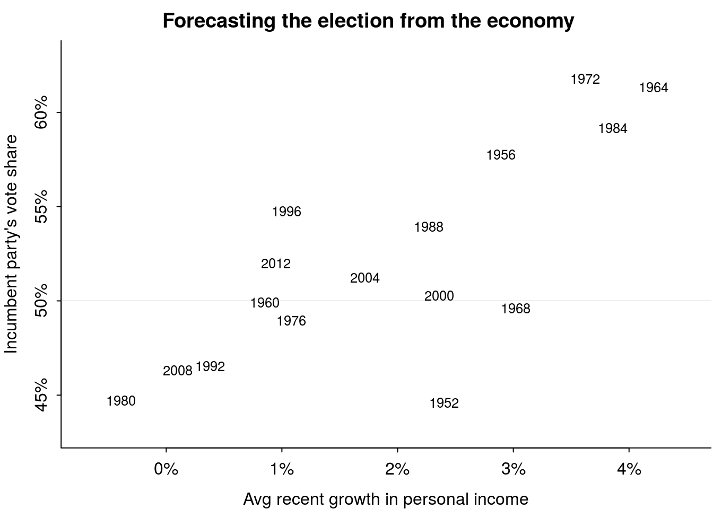
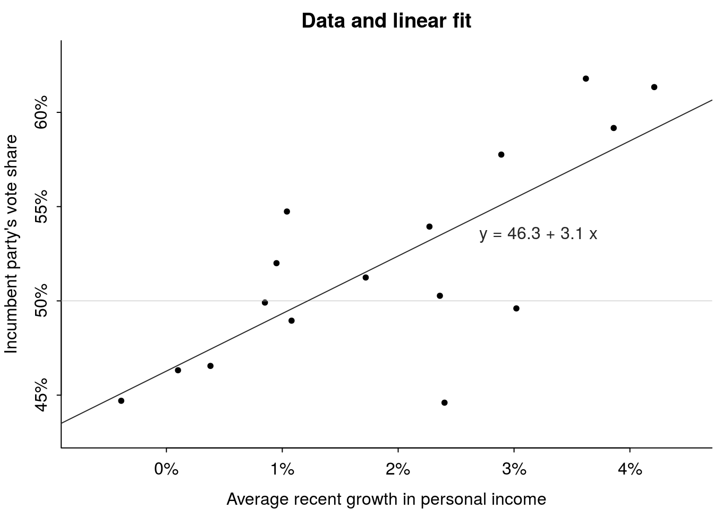

```{r global-knitr-options, include=FALSE}
knitr::opts_chunk$set(fig.pos = 'H',
  fig.asp = 0.618,
  fig.center = "align",
  fig.width = 5,
  out.width = "70%",
  fig.cap = "", 
  fig.path = "",
  echo = FALSE,
  message = FALSE,
  warning = FALSE,
  cache = TRUE,
  fig.show = "hold")
```


```{r echo = FALSE}
library(tidyverse)
library(knitr)
library(kableExtra)
```


# Was ist Inferenzstatistik?


## Deskriptiv- vs. Inferenzstatistik


```{r echo = FALSE}
knitr::include_graphics("/Users/sebastiansaueruser/Google Drive/research/Publikationen/In_Arbeit/Statistik__21/images/Rahmen/desk_vs_inf.pdf")
```


## Wozu ist die Inferenstatistik da?


\begin{alertblock}{Definition}
Inferenzstatistik ist ein Verfahren, das mathematische Modelle verwendet, um von einer bestimmten Datenlage, die eine Stichprobe einer Grundgesamtheit darstellt, allgemeine Schlüsse zu ziehen.
\end{alertblock}


## Die drei Aufgaben der Inferenzstatistik


1. Von der Stichprobe auf die Grundgesamtheit schließen 

2. Von der Experimental- auf die Kontrollgruppe zu schließen

3. Vom beobachteten Messwert auf das zugrundeliegende Konstrukt zu schließen


## Deskriptiv- und Inferenzstatistik gehen Hand in Hand


Für jede Kennzahl der Deskriptivstatistik (d.h. Stichprobendaten) kann man die Methoden der Inferenzstatistik verwenden (auf eine Grundgesamtheit schließen), z.B.:


```{r echo = FALSE}
x <- tribble(
    ~Kennwert, ~Stichprobe, ~Grundgesamtheit,
  "Mittelwert", "$\\bar{X}$", "$\\mu$",
  "Streuung", "$sd$", "$\\sigma$",
  "Anteil", "$p$", "$\\pi$",
  "Korrelation", "$r$", "$\\rho$" ,
  "Regression", "$b$", "$\\beta$"
  
)

kable(x, format = "latex", escape = FALSE, booktabs = FALSE) %>%
  kable_styling(position = "center")
```


Für Stichprobendaten verwendet man lateinische Buchstaben ($X, p, b, \ldots$); für Populationsdaten verwendet man griechische Buchstaben.


## Schätzen von Parametern einer Grundgesamtheit


Meist begnügt man sich nicht mit Aussagen für eine Stichprobe, sondern will auf eine Grundgesamtheit verallgemeinern.

Leider sind die Parameter einer Grundgesamtheit zumeist unbekannt, daher muss man sich mit *Schätzungen* begnügen.

Schätzwerte werden mit einem "Dach" über dem Kennwert gekennzeichnet, z.B.


```{r echo = FALSE}
x <- tribble(
    ~Kennwert, ~Stichprobe, ~Grundgesamtheit, ~Schätzwert,
  "Mittelwert", "$\\bar{X}$", "$\\mu$", "$\\hat{\\mu}$",
  "Streuung", "$sd$", "$\\sigma$", "$\\hat{\\sigma}$",
  "Anteil", "$p$", "$\\pi$", "$\\hat{\\pi}$",
  "Korrelation", "$r$", "$\\rho$", "$\\hat{\\rho}$" ,
  "Regression", "$b$", "$\\beta$", "$\\hat{\\beta}$"
  
)

kable(x, format = "latex", escape = FALSE, booktabs = FALSE) %>%
  kable_styling(position = "center")
```


## Beispiel für eine inferenzstatistische Fragestellung


- Sie testen zwei Varianten Ihres Webshops (V1 und V2), die sich im Farbschema unterscheiden und ansonsten identisch sind.

- Hat das Farbschema einen Einfluss auf den Umsatz?

- Dazu vergleichen Sie den mittleren Umsatz pro Tag von V1 vs. V2, $\bar{X}_{V1}$ und $\bar{X}_{V2}$.

- Die Mittelwerte unterscheiden sich etwas, $\bar{X}_{V1} > \bar{X}_{V2}$

- Sind diese Unterschiede "zufällig" oder "substanziell"? Gilt also $\mu_{V1} > \mu_{V2}$ oder  $\mu_{V1} \le \mu_{V2}$?


## Was heißt "zufällig"?


\begin{alertblock}{Definition}
Unter einem zufälligen Ereignis (random) verstehen wir ein Ereignis, das nicht (komplett) vorherzusehen ist, wie etwa die Augenzahl Ihres nächsten Würferwurfs. Zufällig bedeutet nicht (zwangsläufig), dass es keine Ursachen gibt. So gehorchen die Bewegungen eines Würfels den Gesetzen der Physik, nur sind uns diese oder die genauen Randbedingungen nicht unbekannt (ausreichend) bekannt.
\end{alertblock}


# Regression und Inferenz


## Für jede Fragestellung einen anderen Test


```{r echo = FALSE, fig.align="center", fig.height="7%"}
knitr::include_graphics("img/entscheidungsbaum.pdf")
```


[Quelle](https://md.psych.bio.uni-goettingen.de/mv/entscheidungsbaum.pdf)


## Oder man nimmt einfach immer die Regression


```{r echo = FALSE, fig.align="center", out.width="70%"}

include_graphics("img/linear_tests_cheat_sheet.png")

```

[Quelle](https://lindeloev.github.io/tests-as-linear/)


## To rule 'em all


```{r echo = FALSE, fig.align="center", out.width="50%"}


```


[Quelle](https://imgflip.com/i/5m9qrp)


## Was war noch mal die Regression?

- Regression (Regressionsanalyse) ist eine Methode, um Zielvariablen in Abhängigkeit der Ausprägung von Prädiktorvariablen von Beobachtungen vorherzusagen. 

- Dabei erlaubt die Regression die Quantifizierung der Ungewissheit der Vorhersagen.


```{r echo = FALSE,  out.width=c("40%", "40%")}



```

[Quelle](https://avehtari.github.io/ROS-Examples/ElectionsEconomy/hibbs.html)


## In voller Pracht: Die Regressionsgleichung


$$y = b_0 + b_1x + \epsilon$$


- $y$: Zielvariable (vorherzusagen)
- $b_0$: Achsenabschnitt
- $b_1$: Regressionsgewicht (Steigung der Regressionsgeraden)
- $\epsilon$: "Fehler", Ungewissheit der Vorhersage


## Datenbeispiel


```{r echo = TRUE, results = "hide"}
data(mtcars)
library(rstanarm)
lm1 <- stan_glm(mpg ~ hp, data = mtcars)
```


```{r echo = TRUE, results = "hide"}
print(lm1)
```

```
            Median MAD_SD
(Intercept) 30.0    1.7  
hp          -0.1    0.0  

Auxiliary parameter(s):
      Median MAD_SD
sigma 3.9    0.5   
````


## Visualisierung zum Datenbeispiel


```{r}
ggplot(mtcars,
       aes(x = hp, y = mpg)) +
  geom_point() +
  geom_smooth(method = "lm")
```


## Wozu man die Regression benutzt


- Vorhersagen

- Zusammenhänge untersuchen

- Adjustieren (Zusammenhänge korrigieren)

- Kausalinferenz


## In Experimenten kann man die Ergebnisse kausal interpretieren^[Wenn alles gut läuft.]


```{r echo = FALSE,  out.width=c("40%", "40%")}
include_graphics("/Users/sebastiansaueruser/github-repos/ROS-Examples/SimpleCausal/figs/overview_1a.pdf")
include_graphics("/Users/sebastiansaueruser/github-repos/ROS-Examples/SimpleCausal/figs/overview_1b.pdf")
```


## Die lineare Regression ist erstaunlich flexibel

Z.B. 

- *Nichtlineare* Zusammenhänge

- Interaktionen

```{r echo = FALSE,  out.width=c("40%", "40%")}
include_graphics("/Users/sebastiansaueruser/github-repos/ROS-Examples/SimpleCausal/figs/overview_2a.pdf")
include_graphics("/Users/sebastiansaueruser/github-repos/ROS-Examples/Interactions/figs/interactions_male.pdf")
```


## Häufig sind Gruppen nicht direkt vergleichbar


- *Beispiel*: Die Heilungsraten in der Experimentalgruppe waren höher als in der Kontrollgruppe. Allerdings waren die Personen der Experimentalgrupe auch gesünder (als die Personne der Kontrollgruppe). Um den Kausaleffekt der Behandlung zu schätzen, müssen solche vorab bestehenden Unterschiede zwischen den Gruppen berücksichtigt (adjustiert) werden.


```{r out.width = "40%"}
include_graphics("/Users/sebastiansaueruser/github-repos/ROS-Examples/SimpleCausal/figs/overview_3.pdf")
```


## Keine vorschnelle Kausalinterpretation


- Kausalinterpretationen statistischer Ergebnisse (z.B. Mittelwertsdifferenz von Behandlungs- vs. Kontrollgruppe) ist nur möglich, wenn
    - die Studie gut kontrolliert und randomisiert ist (und die Stichprobe groß ist) oder
    - bestehende Unterschiede nicht randomisiert, aber  kontrolliert wurden oder
    -  diese gemessen und in der Regressionsanalyse berücksichtigt wurden
    
    
Ansonsten muss auf eine Kausalinterpretation verzichtet werden.

Allerdings ist es möglich, Art und Stärke von Zusammenhängen zu schätzen.


# Klassische vs. Bayes-Inferenz


## Klassische Inferenz: Frequentismus


- Die Berücksichtigung von Vorwissen zum Sachgegenstand wird vom Frequentismus als subjektiv zurückgewiesen.
- Nur die Daten selber fließen in die Ergebnisse ein
- Wahrscheinlichkeit wird über relative Häufigkeiten definiert.
- Es ist nicht möglich, die Wahrscheinlichkeit einer Hypothese anzugeben. 
- Stattdessen wird angegeben, wie häufig eine vergleichbare Datenlage zu erwarten ist, wenn die Hypothese gilt und der Versuch sehr häufig wiederholt ist.
- Ein Großteil der Forschung (in den Sozialwissenschaften) verwendet diesen Ansatz.


## Bayesianische Inferenz

- Vorwissen (Priori-Wissen) fließt explizit in die Analyse ein (zusammen mit den Daten).
- *Wenn* das Vorwissen gut ist, wird die Vorhersage genauer, ansonsten ungenauer.
- Die Wahl des Vorwissens muss explizit (kritisierbar) sein.
- In der Bayes-Inferenz sind Wahrscheinlichkeitsaussagen für Hypothesen möglich.
- Die Bayes-Inferenz erfordert mitunter viel Rechenzeit und ist daher erst in den letzten Jahren (für gängige Computer) komfortabel geworden.


## Vergleich von Wahrscheinlichkeitsaussagen


::: columns

:::: column
### Frequentismus

- zentrale Statistik: *p-Wert*

- "Wie wahrscheinlich ist der Wert der Teststatistik (oder noch extereme Werte), vorausgesetzt die Nullhypothese gilt und man wiederholt den Versuch unendlich oft (unter gleichen Bedingungen aber zufällig verschieden)?"

::::

:::: column
### Bayes-Statistik

- zentrale Statistik: *Posterior-Verteilung*

- "Wie wahrscheinlich ist die Forschungshypothese, jetzt nachdem wir die Daten kennen laut unserem Modell?"
::::

:::


## Frequentist und Bayesianer


```{r}
include_graphics("img/frequentists-vs-bayesians-2x.png")
```


[Quelle](https://xkcd.com/1132/)


## Beispiel zum Nutzen von Apriori-Wissen 1


- Ein Betrunkener behauptet, er könne hellsehen.

- Er wirft eine Münze 10 Mal und sagt jedes Mal korrekt vorher, welche Seite oben landen wird.

- Die Wahrscheinlichkeit dieses Ergebnisses ist sehr gering ($2^{-10}$) unter der Hypothese, dass die Münze fair ist, dass Ergebnis also "zufällig" ist.

- Unser Vorwissen lässt uns allerdings trotzdem an der Hellsichtigkeit des Betrunkenen zweifeln, so dass die meisten von uns  die Hypothese von der Zufälligkeit des Ergebnisses wohl nicht verwerfen.


## Beispiel zum Nutzen von Apriori-Wissen 2

- Eine Studie fand einen "großen Effekt" auf das Einkommen von Babies, eine Stunde pro Woche während zwei Jahren an einem psychosozialen Entwicklungsprogramm teilnahmen (im Vergleich zu einer Kontrollgruppe), $n=127$.

- Nach 20 Jahren war das mittlere Einkommen der Experimentalgruppe um 42% höher (als in der Kontrollgruppe) mit einem Konfidenzintervall von 
[+2%,+98%].

- Allerdings lässt uns unser Vorwissen vermuten, dass so ein Treatment das Einkommen nach 20 Jahren kaum verdoppeln lässt. Wir würden den Effekt lieber in einem konservativeren Intervall schätzen (enger um Null).


## Regression in R, der schnelle Weg zum Glück


*Bayesianische* Inferenz in der Regression:

```{r eval = FALSE, echo = TRUE}
lm1 <- stan_glm(y ~ x, data = meine_daten)
```


*Klassische* Inferenz in der Regression:


```{r eval = FALSE, echo = TRUE}
lm1 <- lm(y ~ x, data = meine_daten)
```


# Modelle


## Was ist ein (statistisches) Modell?

- Ein Modell ist ein vereinfachtes Abbild der Wirklichkeit, z.B. in Form einer Landkarte, eines Modellauto oder einer Gleichung [@sauer_moderne_2019].

- Greift relevante Aspekte der Wirklichkeit heraus (und vernachlässigt andere).


```{r, echo = FALSE} 
knitr::include_graphics(file.path("img", "Modell-crop.pdf"))
```


## Beispiel für ein statistisches Modell


$$E = \beta_0 + \beta_1\cdot L + \epsilon,$$

wobei $E$ für *Erfolg in der Klausur* steht, $L$ für die *Lernzeit* und $\epsilon$ für den "Fehler" des Modells, sprich sonstige Einflussgrößen, die im Modell nicht berücksichtigt werden.


## Der Golem von Prag


:::::: {.columns}
::: {.column width="50%"}
```{r, echo = FALSE, out.width="50%"} 
knitr::include_graphics(file.path("img", "170px-Golem_and_Loew.jpg"))
```
[Quelle](https://de.wikipedia.org/wiki/Golem)

::: 
::: {.column width="50%"}


Der Golem von Prag, eine vom Menschen geschaffene Kreatur gewaltiger Kraft, die Befehle wörtlich ausführt. 

Bei kluger Führung kann ein Golem Nützliches vollbringen.

Bei unüberlegter Verwendung wird er jedoch großen Schaden anrichten.
:::
::::::


## Wissenschaftliche Modelle sind wie Golems

:::::: {.columns}
::: {.column width="50%"}
### Golem
- Besteht aus Lehm
- Belebt durch "Wahrheit"
- Mächtig
- dumm
- Führt Befehle wörtlich aus
- Missbrauch leicht möglich
- Märchen
::: 
::: {.column width="50%"}
### Modell
- Besteht aus ~~Lehm~~Silikon
- Belebt durch Wahrheit (?)
- Manchmal mächtig
- einfacher als die Wirklichkeit
- Führt Befehle wörtlich aus
- Missbrauch leicht möglich
- Nicht einmal falsch
:::
::::::

*Wir bauen Golems.*


# Hinweise


## Lehrbuch und Homepage des Lehrbuchs

Dieses Skript bezieht sich auf folgende [Lehrbücher](#literatur): 

- Kapitel 1 aus @gelman_regression_2021, *Regression and other Stories* (mit "ROS" abgekürzt)

- Kapitel 1 aus @McElreath2016 ("ReThink_v1")

Weitere Literaturhinweise sind am Ende der jeweiligen Kapitel der Lehrbücher zu finden

R-Code zum Buch ROS findet sich auf der [Homepage](https://avehtari.github.io/ROS-Examples/examples.html) des Buchs.


## Literatur {#literatur}


<div id="refs"></div>

